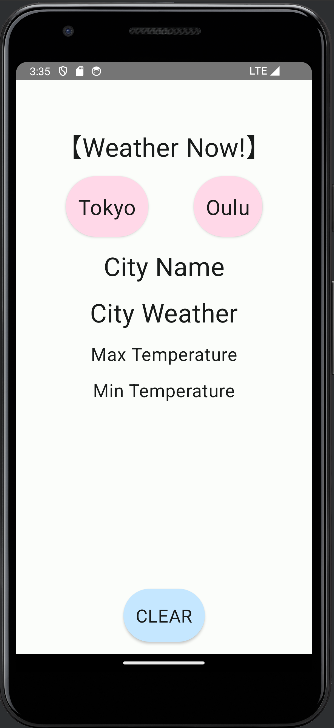
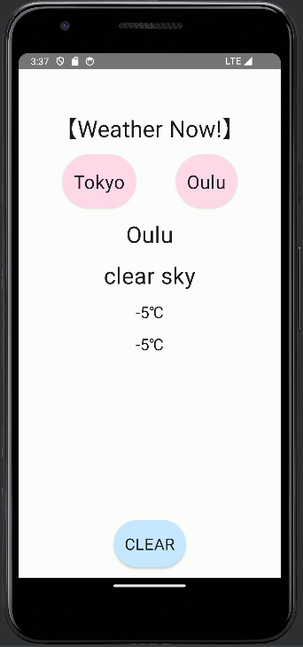
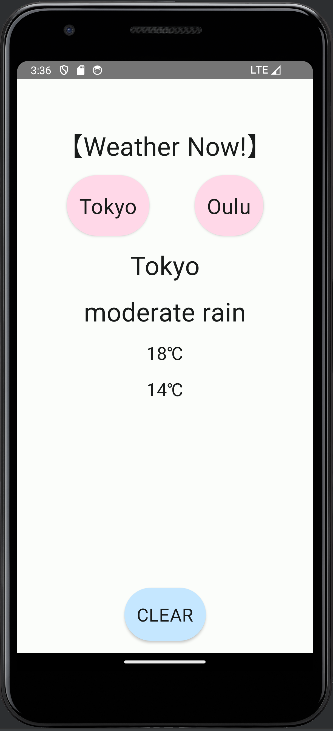
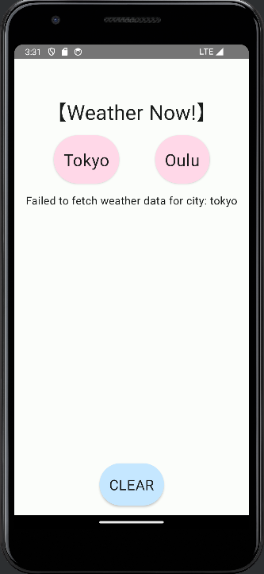

# TokyoOulu Weather App

TokyoOulu Weather App is an Android application built using Jetpack Compose to display weather information.

   

## Overview
This app was created for my parents and children living far away.

This app allows users to retrieve weather information for Tokyo and Oulu. On the main screen of the app, the current weather along with the maximum and minimum temperatures are displayed. Users can switch between cities by clicking buttons.

## How to Use

1. Launch the app.
2. On the main screen, click the "Tokyo" or "Oulu" button.
3. The app will retrieve the weather information and display it on the screen.
4. Once the weather information is displayed, users can reset the information by clicking the "CLEAR" button if needed.

## API Key

- Please insert the provided API key into the parameter of the WeatherModel in the ViewModel file.
- The key will be shared with you separately during submission.
   
## Structure

- `MainActivity`: The entry point of the app. It sets the content using Jetpack Compose's `setContent` function.
- `WeatherApp`: Component to display weather information. It uses `WeatherViewModel` to fetch weather information and update the UI.
- `WeatherButton`: Custom component to provide buttons for users to switch between cities.
- `WeatherViewModel`: ViewModel class to hold the state and functionality for the UI.

## Notes

- This app was created as an assignment for the Android course at Oulu University of Applied Sciences, Spring 2024.

## Development Environment

- Android Studio
- Kotlin
- Jetpack Compose

## Required features

### Grade 4
- **Software Logic**: Complete
- **UI Design**: Color scheme was made by here [M3 material](https://m3.material.io/theme-builder#/custom)
- **Resource Management**: Complete
- **Navigation**: Implements navigation with two screens (main and loading).

### Grade 5 (In addition to Grade 4 features)
- **API Integration**: Using API from [OpenWeatherMap](https://openweathermap.org/)
- **MVVM Architecture**: Complete
- **Code Organization**: Complete
- **Error Handling**: Complete
- **Loading Indicator**: Displays a loading indicator

